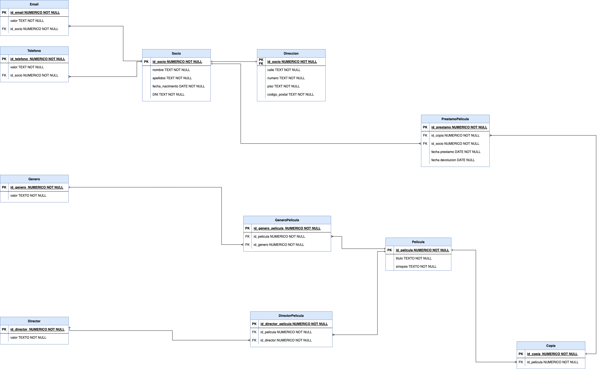

**VideoClub**

Durante una comida familiar, tu primo te comenta que acaba de abrir un videoclub . Dice que
no le está yendo todo lo bien que pensaba y cree que es porque no tiene un software adecuado
para registrar los préstamos y el inventario de películas.
Le intentas explicar que tal vez la causa sea que existe Netflix, pero como le ves ilusionado, le vas a echar una mano.

Requisitos funcionales

Ya haciendo la digestión del chuletón y la tarta de la abuela, te cuenta lo siguiente:

- Necesito registrar los socios del videoclub. Al menos necesito su nombre y apellidos,
fecha de nacimiento, teléfono y su número de identificación (DNI, Pasaporte, o el nombre
que reciba en tu país) y nosotros le asignaremos un número de socio que usaremos para
hacer carnets (definitivamente tu primo se quedó en algún momento de los 90’s ).
- Necesito registrar la dirección de correspondencia de los socios para, eventualmente,
hacer campañas de publicidad, pero no es un requisito obligatorio que un socio nos de
esa información. Con el código postal, calle, número y piso es suficiente,
sobreentendemos que será de la misma ciudad donde está el videoclub.
- Necesito registrar las películas. Puedo tener más de una copia de cada una. De cada
película necesito registrar el título, género, director y sinopsis.
- Necesito saber a que socio le he prestado cada copia y cuando. Es decir, registrar la
fecha en la que se la ha llevado y la fecha de la devolución. Cuando una película no tiene
fecha de devolución, la consideramos prestada.
- Para ir tirando, necesito consultar a menudo:
o Que películas están disponibles para alquilar en este momento (no están
prestadas). Necesito saber el título de la película y el número de copias
disponibles.

Esta práctica se entregará en dos partes :

- 1. Diagrama Entidad/Relación en formato draw.io

- 2. Script SǪL que debe crear un nuevo esquema, crear todas las tablas, cargar datos y las
dos consultas que se piden (aunque el script solo mostrará la última, deben ir las dos).

[Script SQL](./videoclub.sql)

[Texto extraído de práctica Keepcoding - Beca Analisis de Datos. Glovo. 2024]
